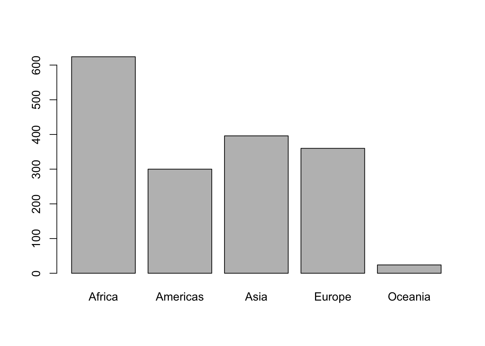

```r
# Load packages
library(here)
```

```
## here() starts at /Users/claudiuforgaci/Projects/repro-r-workshop-livecode
```

```r
library(tidyverse)
```

```
## ── Attaching packages ─────────────────────────────────────── tidyverse 1.3.1 ──
```

```
## ✔ ggplot2 3.3.6     ✔ purrr   0.3.4
## ✔ tibble  3.1.8     ✔ dplyr   1.0.9
## ✔ tidyr   1.2.0     ✔ stringr 1.4.1
## ✔ readr   2.1.2     ✔ forcats 0.5.1
```

```
## ── Conflicts ────────────────────────────────────────── tidyverse_conflicts() ──
## ✖ dplyr::filter() masks stats::filter()
## ✖ dplyr::lag()    masks stats::lag()
```


```r
# Load data
path <- here("data", "gapminderDataFiveYear.tsv")
gapMinder <- read.delim(path)
```

# Heading

## Sub-heading

Text...

### Sub-heading

Text...

# Introduction

<!-- This is a note -->

This paper uses the **tidyverse** package along with the *gapminder* dataset, which contains the columns:

1.  country

-   Name of country

2.  year

-   Year of observation

3.  pop

-   Population of country

4.  continent

-   Continent where the country is located

5.  lifeExp

-   Life expectancy

6.  gdpPercap

-   GDP per capita

## Insert table

The average GDP per capita grouped by `continent`.


```r
gapMinder |> 
  group_by(continent) |> 
  summarise(mean_gdpPercap = mean(gdpPercap)) |> 
  knitr::kable(caption = "We can also add a caption",
               col.names = c("Continent", "Mean GDP per Capita"))
```


Table: We can also add a caption

|Continent | Mean GDP per Capita|
|:---------|-------------------:|
|Africa    |            2193.755|
|Americas  |            7136.110|
|Asia      |            7902.150|
|Europe    |           14469.476|
|Oceania   |           18621.609|

## Inline R code


```r
cont <- "Europe"
mean_continent <- gapMinder |> 
  group_by(continent) |> 
  summarise(mean_lifeExp = mean(lifeExp)) |> 
  filter(continent == cont)
mean_continent
```

```
## # A tibble: 1 × 2
##   continent mean_lifeExp
##   <chr>            <dbl>
## 1 Europe            71.9
```

The average life expectancy in Europe is 71.9

## Plots


```r
continents <- factor(gapMinder$continent)
plot(continents)
```




```r
ggplot(data = gapMinder,
       mapping = aes(x = continent)) +
  geom_bar()
```


